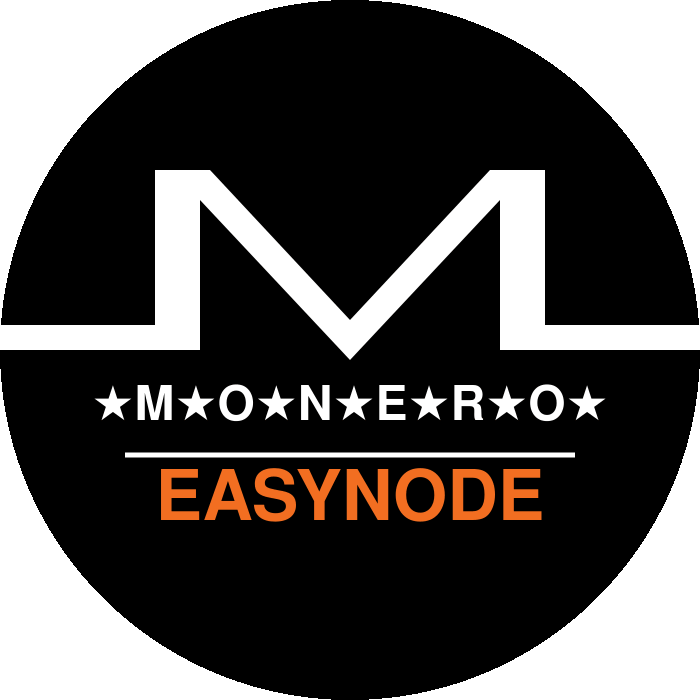
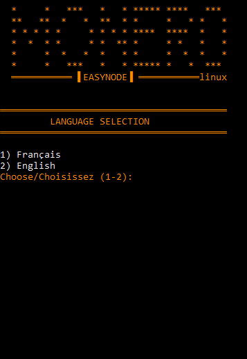
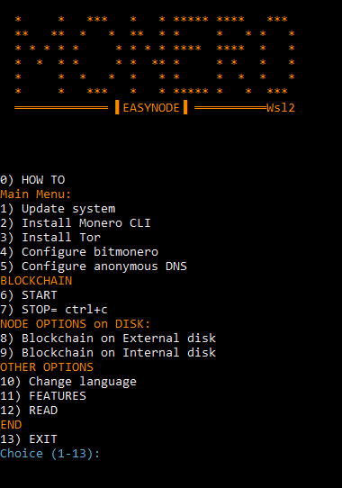
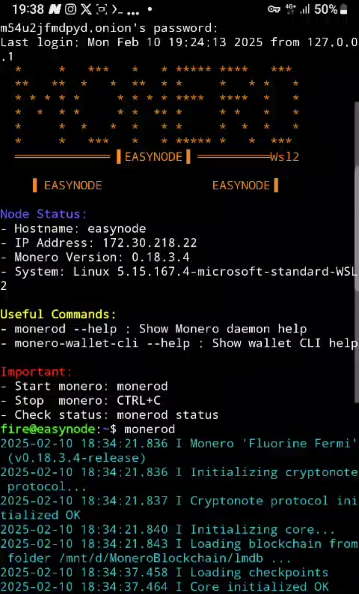
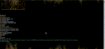

<div align="center">
  <table style="border: 10px solid #FF6600;">
    <tr>
      <td align="center"  width="400">
        <h3>WINDOWS VERSION</h3>
        <h3>Would you like a Linux version?</h3>
        <h4>See the <a href="https://github.com/kerlannXmr/EasyMonerod">Linux version</a> of this project</h4>
         <p>🔄change version </p>
  <a href="https://github.com/kerlannXmr/easynode_windows">
    
  </a>
  <a href="https://github.com/kerlannXmr/EasyMonerod/">
    
  </a>
      </td>
    </tr>
  </table>
</div>

---

[](mailto:easynode@kerlann.org)
[](https://easynode.kerlann.org/fr.html)
[](https://monero.eco/infrastructure/)
[](https://bank-exit.org/tutoriels/monero-node-easymonerod)


<div align="center"></div>

<div align="center">

## Make easy a MONERO Node 



<br>
<br>

[▶️ Demo video](https://mega.nz/file/5uFzVRKR#w2RehS8LNruoM7A1vxnJPIm3ipjif1EYL_hg4MMoYW0) *("Open in new tab")*

</div>

<hr style="border-top: 3px solid orange;">
<b>'EasyNode'</b> simplifies the installation of a <b> 'MONERO node' </b> , allowing you to configure your blockchain in just a few clicks. A complete setup in less than 10 minutes! (inclued 0.18.4.1 Monero CLI and officiel Hash verification)

Then download its blockchain ⬇️ ...

Finally, start your adventure, you are sovereign...

You can use it in 🪟 windows  10/11 in wsl2 version. 

No knowledge required. Select step 1➡️2➡️3➡️4➡️5 and you're done. 
After Boot to your internal drive, 6️⃣, or move the blockchain to your external disk, 8️⃣.

The node is protected by Tor and an onion address allows you to connect to a mobile wallet.
An SSH onion address is available to access the node remotely.
Added the 'MRL' IP bann list of 'boog900'.

🇬🇧 English- 🇫🇷French

Enjoy.

### ❕ DISCLAIMER ❕

This script is designed **for dedicated Monero node PCs with Monero_Gui** and makes system modifications.

- Don't use on primary computers first or production systems, and by using it you accept responsibility.

## <div align="center">🖥️ Interface:</div>
<div align="center">
<!---->



  <b> SSH REMOTE:</b>
<br>




<br>
<br>

[](https://mega.nz/file/5uFzVRKR#w2RehS8LNruoM7A1vxnJPIm3ipjif1EYL_hg4MMoYW0) 

<a>right click + "Open in new tab"</a>

 <br>

</div>

## <div align="center">📝 HOW TO</div>

### Internal disk :
- Follow the step 1➡️2➡️3➡️4➡️5
- Then do : Step 6️⃣

### External Disk :
- Follow the step 1➡️2➡️3➡️4➡️5
- Then do : Step 8️⃣ and 6️⃣

```
1️⃣ Option 1: System update
2️⃣ Option 2: Install Monero
3️⃣ Option 3: Install Tor
4️⃣ Option 4: Configure bitmonero
5️⃣ Option 5: Anonymous DNS
   ├── Choice: Internal disk (direct)
   │   └── 6️⃣ Option 6: Start blockchain
   └── Choice: External disk (setup first)
       └── 8️⃣ Option 8: External disk → 6️⃣ Option 6: Start blockchain
7️⃣ Option 7: Stop blockchain
8️⃣ Option 8: External disk 
9️⃣ Option 9: Return to internal disk
```

## <div align="center">📥 Download:</div>
<div align="center">
  
⇨ 📂 Into path: `/home/$user`
</div>

<div align="center">

| Version | Links |
|---------|------|
| 🪟 WSL | [](https://github.com/kerlannXmr/easynode_windows/releases/download/v4/easynode_wsl.sh) |
</div>

## <div align="center">🚀 Installation</div>
### 🔒 IP ban_list: (spy, malicius)

◇  Automatic updated 'IP ban-list' in this folder :
-  `/home/$user/.bitmonero`

( Updated: github.com/Boog900/monero-ban-list/blob/main/ban_list.txt )


## 🪟 Windows 10/11 (WSL2) :
### ⚫ 1) Verify WSL2 :

-🔺 Make sure virtualization is enabled in bios: Tape in powershell Administrator :

↳ ` Get-ComputerInfo -Property "HyperV*" ` = True ✅

-🔺 Make sure you already have <b>WSL2</b>:

↳ `wsl --list --verbose` [👉 View issue](https://github.com/kerlannXmr/EasyMonerod/issues/4#issue-2873484919) *(right click + "Open in new tab")*

### ⚫ 2) Install Ubuntu:
-🔷 Go to <b>Microsoft Store</b>, then in search type Ubuntu, click on Ubuntu 24LTS.

Other:

-🔶  <b>In powershell administrator:</b>
```bash
wsl --install
```
learn.microsoft.com/fr-fr/windows/wsl/install

learn.microsoft.com/en-us/windows/wsl/install

### ⚫ 3) Download & Install <b>script</b> : 
/home/$user

- ⚡Beginner users: copy&paste in new terminal

```bash
wget https://github.com/kerlannXmr/easynode_windows/releases/download/v4/easynode_wsl.sh -O easynode_linux.sh && chmod +x easynode_linux.sh && sudo ./easynode_linux.sh
```
- Normal user

```bash
sudo wget -P ~ https://github.com/kerlannXmr/easynode_windows/releases/download/v4/easynode_wsl.sh
```
Make it executable
```bash
sudo chmod +x easynode_wsl.sh
sudo ./easynode_wsl.sh
```
## <div align="center"> ❔ How it Works ❔

<div align="center"></div>


## <div align="center">⚡ Features</div>

## 📋 Essential Features / Fonctionnalités Essentielles

| **Feature / Fonctionnalité** | **🇺🇸 English** | **Details / Détails** |
|-------------------------------|------------------|------------------------|
| **🎯 One-Click Installation** | Complete automated setup | 13-step guided menu |
| **🛡️ IP Ban Protection** | Auto-blocks malicious nodes | 3-month bans from github ban-list |
| **🔒 Enhanced Security** | Tor + SSH + IP banning | `.onion` addresses generated |
| **💾 Flexible Storage** | Internal/External disk support | Automatic mounting & UUID config |
| **📊 Real-time Monitoring** | Live peer connections display | IN/OUT peers with colors |
| **🛡️ Automatic Firewall** | Pre-configured ports & UFW | All Monero ports opened |
| **🔧 Zero Configuration** | No Linux expertise needed | Beginner-friendly interface |
| **🛑 Safe Shutdown Control** | CTRL+C clean blockchain stop | Prevents corruption & returns to menu |
| **⚖️ Blockchain Size Options** | Choose Full (220GB) or Pruned (90GB) | Flexible storage requirements |
| **🌐 Anonymous DNS Setup** | Secure DNS auto-configuration | Privacy-focused DNS servers |

- ✅ Automated installation
- ✅ Disk management (internal/external)
- ✅ Built-in Tor (Tor/SSH onion address)
- 🔒 Block IP 'ban listed' (MRL) [👉Issue](https://github.com/kerlannXmr/EasyMonerod/issues/3#issue-2871012436)*(right click + "Open in new tab")*          
- 🔒 TOR SSH remote access :  [👉Issue](https://github.com/kerlannXmr/EasyMonerod/issues/2#issue-2870954425)*(right click + "Open in new tab")*                              
- ✅ Intuitive user interface
- ✅ no knowledge required

## <div align="center">⚠️ Important</div>

-➡🟧 REDIRECT port 22 and 18080 from your internet router to your ' local ip ' of your PC.

-18080 allows other Monero nodes to connect to your node, increasing the decentralization and resilience of the network. [👉Issue](https://github.com/kerlannXmr/EasyMonerod/issues/10)

-➡🟧 The external hard drive must be formatted in NTFS (classic) or exFat or ext4.

Because FAT doesn't handle files larger than 4 GB!  [👉Issue](https://github.com/kerlannXmr/EasyMonerod/issues/9)    

-➡📗  Remote access wallet:
  
  Take 'cake wallet', settings, connect and sync, manage nodes, add +, node address= onion Tor, node port= 18081, save. Close and open. Wait the sync.

  or

  Take "Monero Gui", choose "Distant Mode" then " + add new node " and write 'IP local' or 'IP WEB' and port " 18081 "
  
-➡📗  Remote access ssh, port 22:
   
  Open terminal pc or take 'Termux' on android: ' ssh username@local_ip_pc ' . Or ' ssh username@onion_ssh_address '.[👉Issue](https://github.com/kerlannXmr/EasyMonerod/issues11) 
    
-➡🟧 Stop the Blockchain : CTRL+C 

## <div align="center">🔄 Compatibility</div>

<div align="center">
<br>
  
| Distribution | Compatibilité | Notes |
|--------------|---------------|-------|
|      ✅      |       ✅      |     ✅ |

</div>

 **Shell scripts ' EasyNode 'use standard commands that are more portable across different Linux distributions.**
<br>
-➡📗[👉View Issue Distribution compatibility](https://github.com/kerlannXmr/EasyMonerod/issues/8)*(right click + "Open in new tab")*  
<br>
<br>

## <div align="center">🔰 Packages installed by EASYNODE</div>

<br>

- 📝   See the list of packages at this issue [👉PACKAGES list pre-installed ](https://github.com/kerlannXmr/EasyMonerod/issues/6)*(right click + "Open in new tab")*

<br>

## <div align="center">☣️ EasyNode Scripts TEST report</div>

<div align="center">

### Security Scan Results


  
 <b>Right click + "Open in new tab" to view scann results </b>
| Script | Jotti.org | MetaDefender | virscan |
|--------|------------|--------------|--------------|
| EasyNode_wsl | [](https://virusscan.jotti.org/en-US/filescanjob/g2cclgh3qj) | [](https://metadefender.com/results/url/aHR0cHM6Ly9naXRodWIuY29tL2tlcmxhbm5YbXIvZWFzeW5vZGVfd2luZG93cy9yZWxlYXNlcy9kb3dubG9hZC92NC9lYXN5bm9kZV93c2wuc2g=) | [](https://www.virscan.org/report/9fe00be0043c5d0f266d13319e14738f567b9fd4b920fe37ad1d7210b04389b0)


</div>

<br>

---

### ⚠️ Security disclamer

| 💚  **DESIGNED FOR** | 🖥️ **Dedicated PC for Monero Node Only with Monero_Gui** |
|:---:|:---|
| ⚠️ **WARNING** | 🚫 **Don't use on primary computers or production systems** |

| ⚖️ LEGAL | by using this script, you accept responsability |
|:---:|:---|

---

## 💬  Contact

[](mailto:0595c16adb0e1f467740b5bb4d7e51c8b25042695bc4bd9ebd2e66902720dcbb02)
[](https://matrix.to/#/!diwbZJBzNngFIyfVVh:matrix.org?via=matrix.org)
[](https://simplex.chat/contact#/?v=2-7&smp=smp%3A%2F%2F0YuTwO05YJWS8rkjn9eLJDjQhFKvIYd8d4xG8X1blIU%3D%40smp8.simplex.im%2FhVfnrjb6LGrdWF8dcfEO_3funYfYrCsm%23%2F%3Fv%3D1-3%26dh%3DMCowBQYDK2VuAyEA6eMOBbH4MauXsCWIaZO8r1P7QPCorbwiOSHz0rofgUI%253D%26srv%3Dbeccx4yfxxbvyhqypaavemqurytl6hozr47wfc7uuecacjqdvwpw2xid.onion&data=%7B%22type%22%3A%22group%22%2C%22groupLinkId%22%3A%22IB1UQAdA78A2sbjixkya_g%3D%3D%22%7D)
[](mailto:easynode@kerlann.org)

## ♠️ Support

- 📝 Consult F.A.Q. [👉Questions](https://github.com/kerlannXmr/EasyMonerod/issues/5)*(right click + "Open in new tab")*
- 📝 Consult the [👉Documentation](https://tinyurl.com/kerlann)*(right click + "Open in new tab")*

## 🫶 Thankful

- 🧭 Thanks [👉Monero eco-system](https://monero.eco)*(right click + "Open in new tab")*
- 🇫🇷 Thanks [👉unbanked0](https://github.com/Unbanked0)*(right click + "Open in new tab")*


<div align="center">

---
###  <b>Make donnation with 'cake wallet' to : ' kerlann.xmr '</b>
<div align="center"></div>
or fundraiser

[](https://xmrchat.com/easymonerod)
[](https://kuno.anne.media/fundraiser/dkbu)

---


Made with ❤️ by [KerlannXmr](https://github.com/kerlannXmr)

</div>
<div align="center"></div>
